# Exercise 1 - Build and Deploy the base version of your application

In this exercise, we will set-up the base application using SAP Cloud Application Programming Model and SAP Build Code.
The application will be deployed to SAP BTP and integrated into SAP Build Work Zone, standard edition.
With that, the app will also be available in SAP Mobile Start.
This will be our basis to further optimize the application in the subsequent excercises for our mobile use case with mobile native features.

## Exercise 1.1 Clone the repository in SAP Build Code

1. Open [SAP Build Code using the SAP Build Lobby](https://ca260-c0ym91e3.eu10.build.cloud.sap/lobby) and log-in with the provided credentials.

2. In the project's table, click on the button `Create` and select `Clone from Git` from the drop-down menu.

3. Select the application type `Full-Stack Node.JS`

    <p align="center">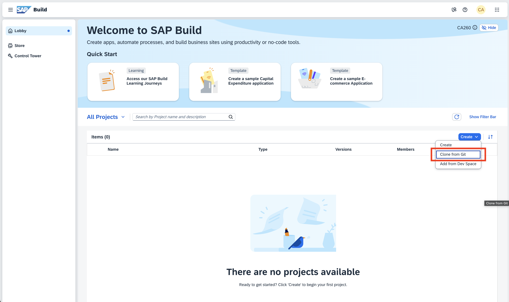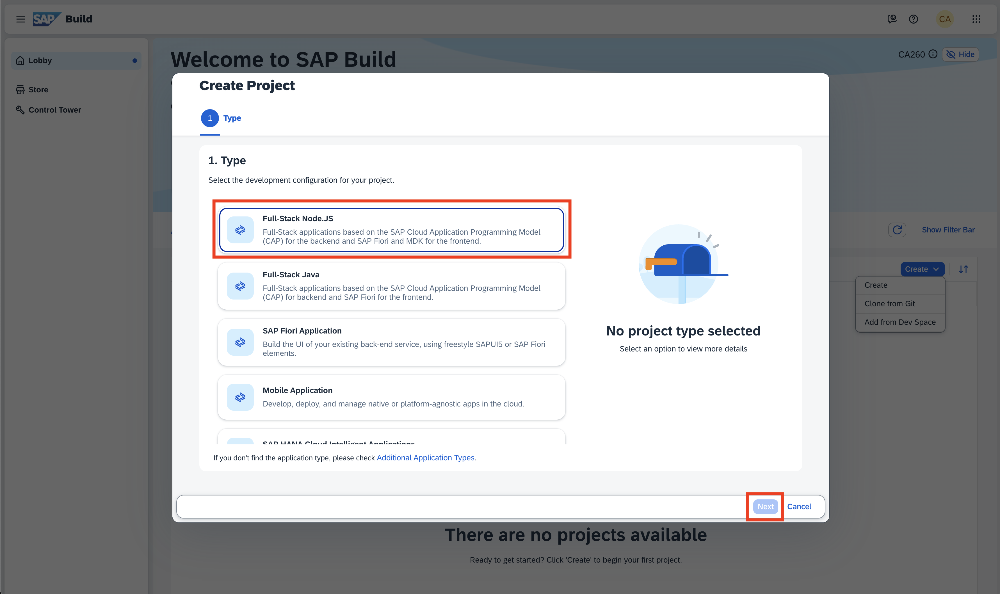</p>

4. Click `Next` and fill out the form fields

    - The following URL into the field `Clone from Git`

      ```
      https://github.com/SAP-samples/teched2025-CA260
      ```

    - `CA260-###` as the projects name

    - Keep the value prefilled for `Dev Space`

    <p align="center">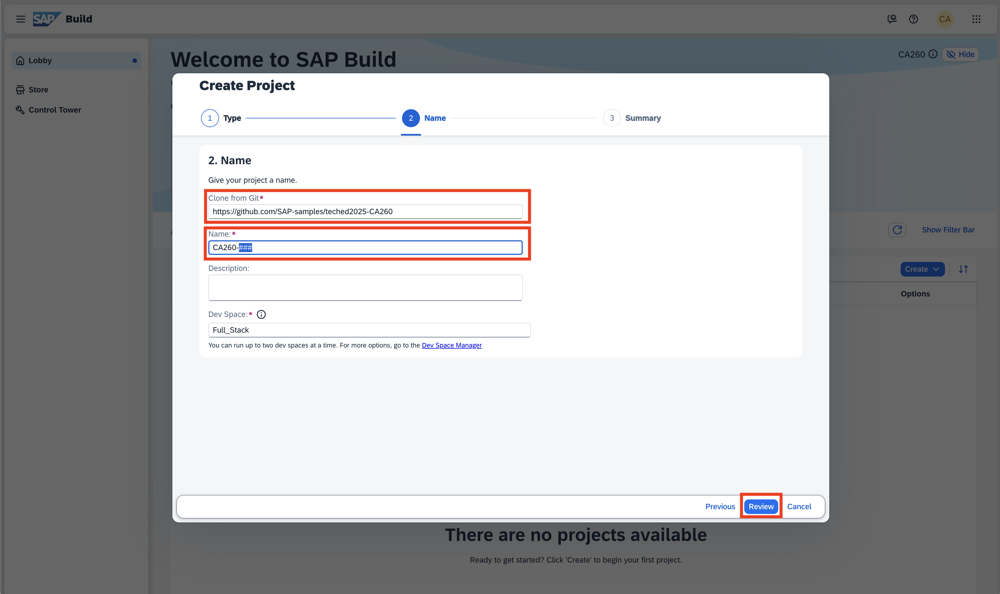</p>

> [!CAUTION]
> Make sure to replace `###` with your participant number.  
> For example participant number `1` results in `CA260-001`

5. Click `Review` and complete the creation of the project by clicking `Create`.

> [!NOTE]  
> *SAP Build Code* will now create and launch your Dev Space. This might take a short moment.  
> Once created, this session's respository containing the base version of our app will be cloned.
> As a result you will see your *SAP Build Code* project launched in *SAP Business Application Studio*.

> [!TIP]
> Instead of using *SAP Build Code*, you can also use Visual Studio Code locally on your machine. Please note that you may need to install a couple of extensions in order to get the same productivity tools, like building & deploying the MTA.  

6. Once the project has been clone successfully, click on the burger menu in the top left corner.

7. Select `Edit` and click on `Replace in Files`.  
    Enter `###` in the search field and enter **your** participant number (e.g. `001`) in the replace field.

8. Click on the small `Replace All` button next to the replace text field and confirm the dialog with the button `Replace`

    <p align="center">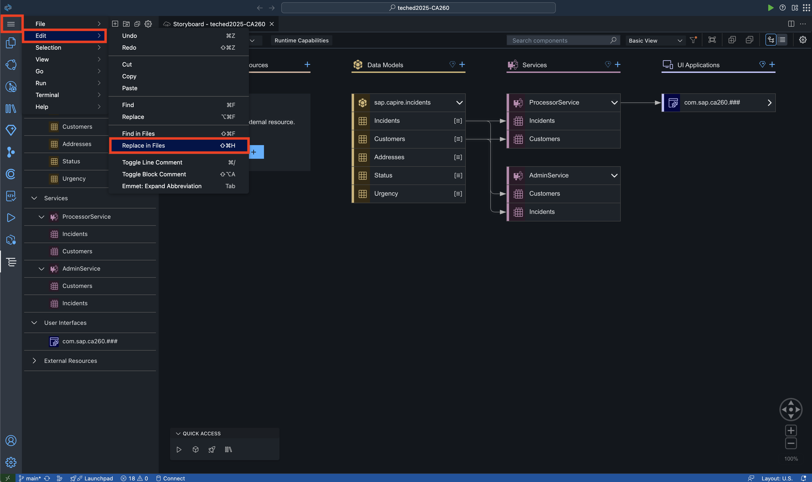</p>
    <p align="center">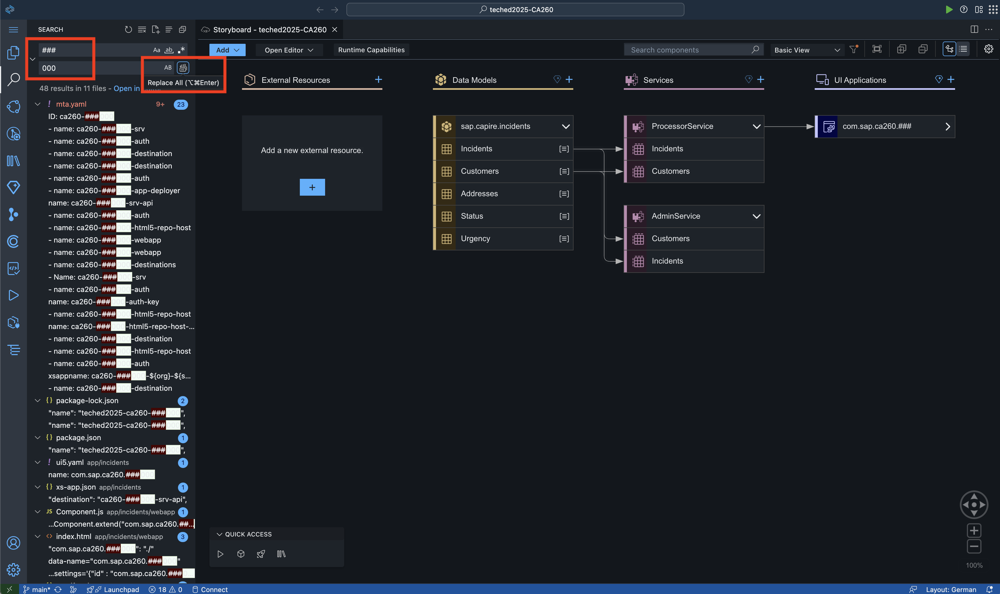</p>

> [!CAUTION]
> It is **very important** that all occurrences of `###` are replaced with the correct value of your participant number, otherwise the deployment and subsequent steps will not work properly. The upcoming excercises build upon this correct value and the correct value is required to not interfere with other participants.

## Exercise 1.2 Deploy the base application

> [!NOTE]
> After completing these steps you will have your base application deployed to the *SAP Business Technology Platform*.
> As the deployment will take some minutes, we will start it first.
> While we wait for it to finish, we take a look at the base application and understand it better.

1. Click again on the burger menu on the top left corner.

2. Select `Terminal` and click on `New Terminal`.  
    A command line terminal will appear as a bottom pane.

3. Enter the following command and hit *Enter* to install the packages, that are required for building our application:

    ```bash
    npm install
    ```

    <p align="center">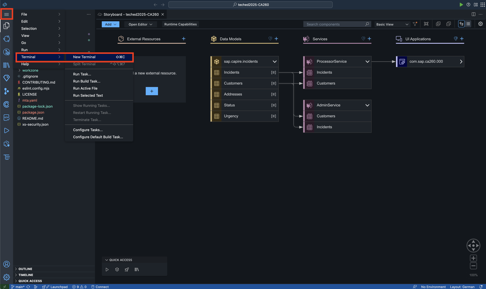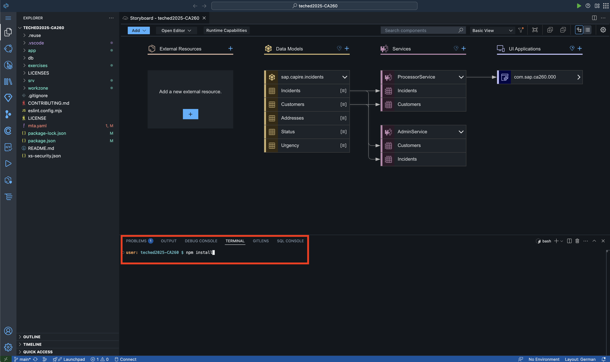</p>

4. Select the `Explorer` view right below the burger menu to display the project's folder & file structure.

5. Right-click on the file `mta.yaml` and select `Build MTA Project` from the context menu in order to build the project.

> [!NOTE]
> The `mta.yaml` file is the central descriptor of a *Multitarget Application* ([learn more](https://help.sap.com/docs/btp/sap-business-technology-platform/multitarget-applications-in-cloud-foundry-environment?locale=en-US&version=LATEST)).
> It contains a description of all necessary compontents of our full-stack application and how these components need to be deployed to the SAP BTP in order to function correctly.
> The result of this build operation is a *mta archive* (.mtar), that contains everything to run the actual deployment.

6. Once completed, locate the build result in the folder `mta_archives`.

7. Right click the `ca260-###_1.0.0.mtar` file and select `Deploy MTA Archive`.

    <p align="center">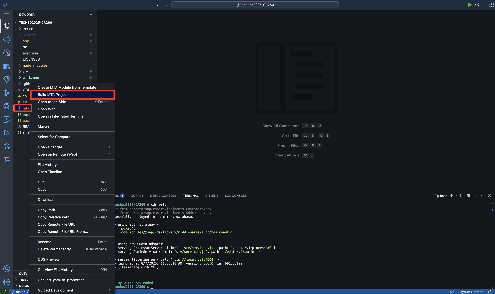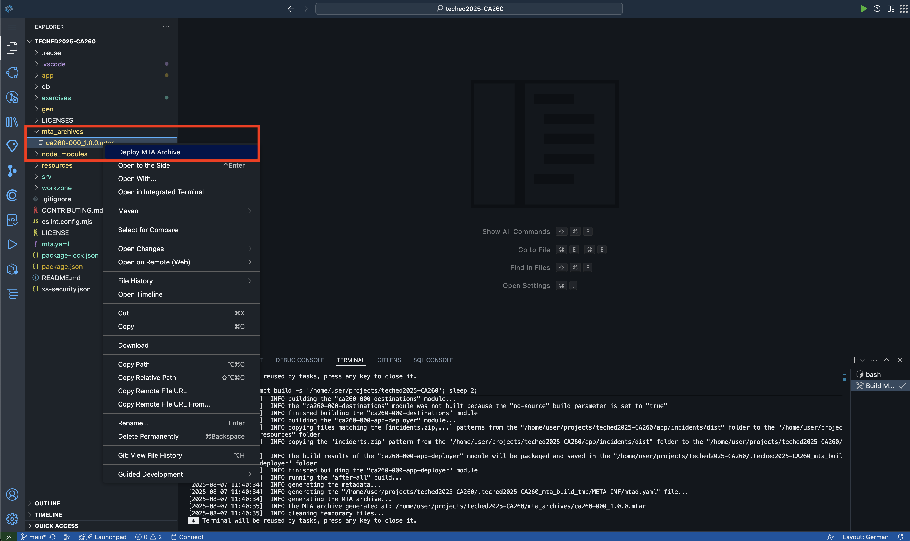</p>

> [!NOTE]
> When deploying for the first time, you will need to sign-in to *Cloud Foundry* of the *SAP BTP*.  
> A window *Cloud Foundry Sign In and Targets* will appear.  
> The subsequent steps only need to be executed before the first deployment.

8. In the sign-in window, keep the values for *endpoint* and *authentication method* as pre-filled.  
    Click on the link *"Open a new browser page to generate your SSO passcode"*.

9. In order to sign in with our identity provider, enter:  

    ```
    teched02-platform
    ```

    into the form field and click on the button `Sign in with alternative identity provider`.
    Sign in with the credentials provided to you.

10. Click on the *Copy* icon next to the *Temporary Authentication Code* that shows after successfully logging in.

    <p align="center">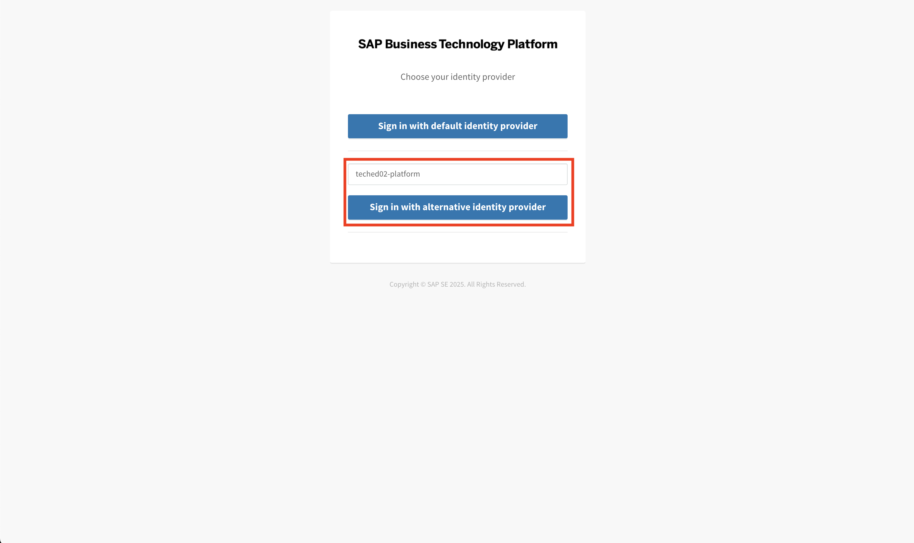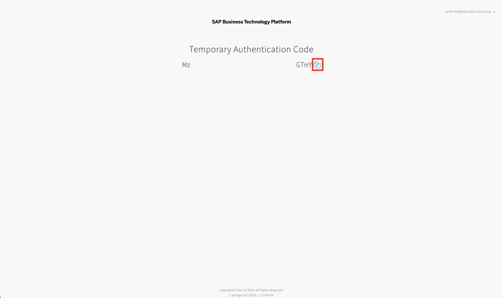</p>

11. Going back to the *SAP Business Application Studio*, paste the copied authentication code into the field *Enter your SSO Passcode*.
    Afterwards, click the button `Sign in`.

12. Select the *organization* `ca260` and the *space* `CA260` as *Cloud Foundry Target*, to which we will deploy our application.  
    Click `Apply` and continue with the deployment.

    <p align="center">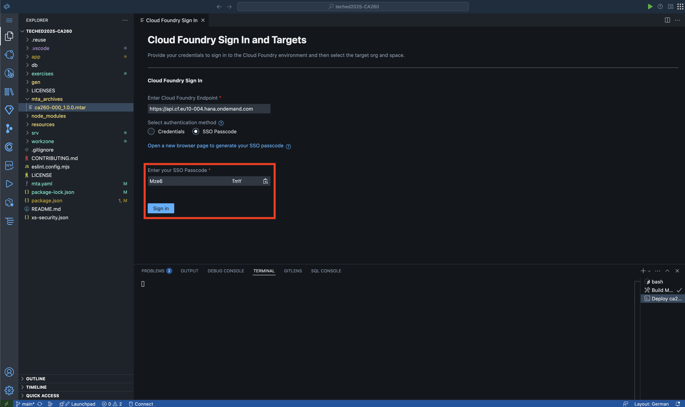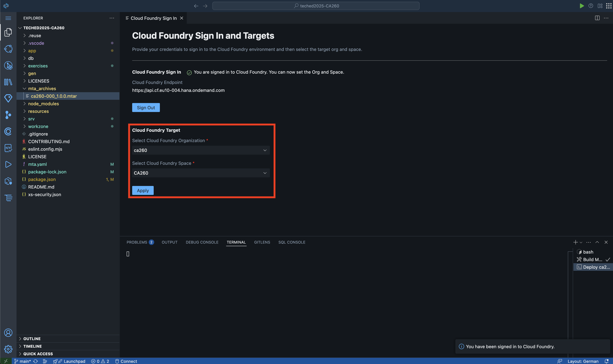</p>

> [!NOTE]
> The deployment will take some minutes.
> Please use the time to continue reading through the summary below and getting an overview on the application we are currently deploying to SAP BTP.
> You can follow the status of the deployment in terminal tab.

## Summary

You've now cloned our repository in *SAP Build Code* that will act as the base application for the subsequent excercises by creating a new project in the *SAP Build Lobby*.
Since it is a *Full-Stack Node.JS* project, we installed the required dependencies declared by the `package.json` file using `npm`.
The application we will use as a basis in this course is a slightly modified version of the well-known *Incidents Management* reference application[^1] for *CAP*.
It can be used to file new incidents
Processors can work on reported incidents and have the current status reflected in the tool.

> [!NOTE]
> For the purpose of this hands-on workshop, we have simplified certain aspects of the full-stack application, for example the data is not stored in a persistent database but only in-memory.

*SAP Business Application Studio* using the project configuration of *SAP Build Code* is showing the project's Storyboard by default after loading the project.
This gives us a good overview of our application.
Like the name implies, the app can be used to manage incidents.
We can observe there is a data model (yellow) defined under the folder `/db` with 5 entities to represent our scenario.  
Two *CAP* services (red) exist to give data access to the data layer.
The service layer is defined and can be extended by application logic located in the `/srv` folder.
*CAP* will automatically expose the defined services using OData APIs.
In this course, we will only use the *ProcessorService*.  
Using *SAP Fiori Elements* the *ProcessorService* is connected to a *SAP UI5* User Interface.
Its definitions are located in the folder `/app`.  
The folder `/workzone` contains a single file that defines the structre in which our application should appear as tile in *SAP Build Work Zone, standard edition* and *SAP Mobile Start* – additionally the user role that should be required in order to see the application tile.

<p align="center">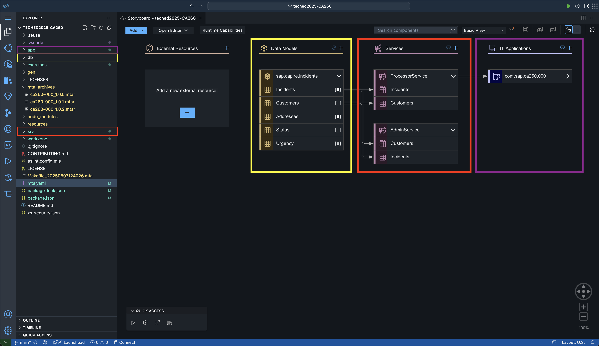</p>

> [!NOTE]
> If you want to learn more about the *SAP Cloud Application Programming Model* in general, please refer to the [official documentation](https://cap.cloud.sap/docs/).

> [!TIP]
> You can also test the application locally by running `cds watch` in a terminal window.
> When doing so, wait for the application to be started and click on the link shown in the terminal output.
> <p align="center">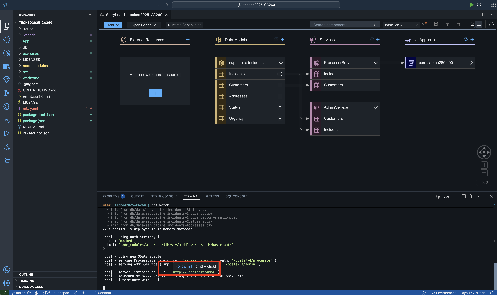</p>
> <p align="center">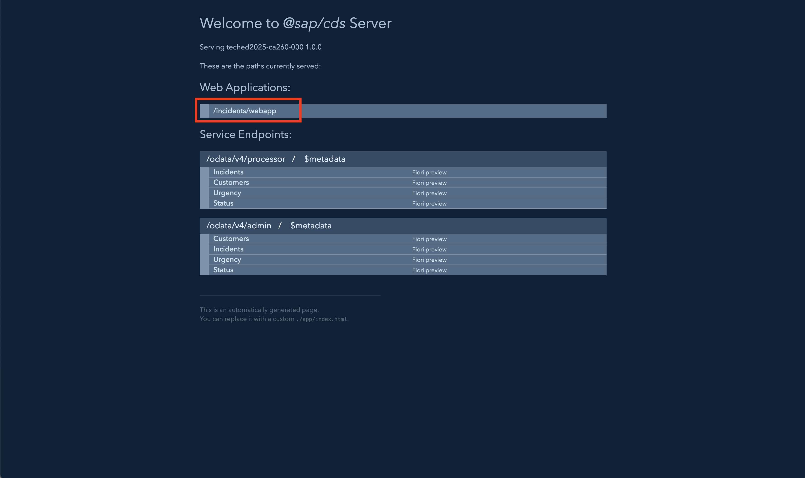</p>
> 
> By clicking on `/incidents/webapp`, you can open the defined UI of our application.
> With this most of the functionality can be tested locally even before deploying the application to any *SAP BTP* environment.
> Please note that certain functionality depending on dedicated *SAP BTP* services is either mocked or not available.

Check back in the terminal tab of the deployment, whether the process already finished successfully.
Upon success, you can log in to the [*SAP BTP Cockpit*](https://emea.cockpit.btp.cloud.sap/cockpit/?idp=teched02.accounts.ondemand.com#/globalaccount/b014fa39-27ae-4058-99ca-13ac40ad60c3/subaccount/b2adace6-7cff-4ddd-afeb-251127e20c9f) and see the deployed resources.
In the navigation menu on the left-side, go to *HTML5 Applications*.
Here you should be able to find your application under the name `comsapca260###` (`###` replaced with your participant number).
Take a note of the value shown under *Business Solution*, which should be `ca260###` where `###` is your participant number.

Afterwards, you can navigate to *Cloud Foundry* and the sub-menu entry *Spaces*.
Select the space `CA260`.
Under *Applications* you should be able to find two applications with your participant number.
The one named `ca260-###-srv`, where `###` is your participant number, is our *CAP* backend service.

<p align="center">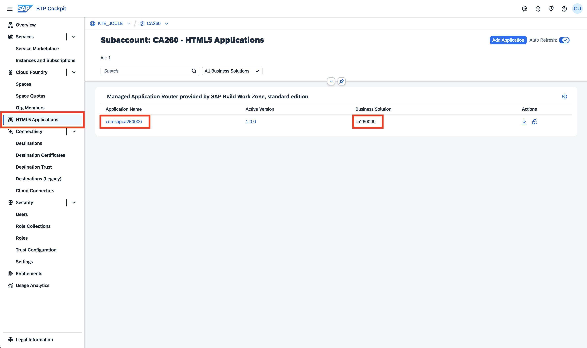</p>
<p align="center"></p>

> [!IMPORTANT]
> **Congratulations!** :partying_face:
> You have completed the first exercise successfully.
> After knowing how to deploy the app, we can now continue and further optimize it for mobile native features in *SAP Mobile Start*.  
> Continue now with - [Exercise 2 - Integrate the app into SAP Build Work Zone & SAP Mobile Start](../ex2/).

[^1]: [cap-js/incidents-app](https://github.com/cap-js/incidents-app) on Github
