# Exercise 2 - Integrate the app into SAP Build Work Zone & SAP Mobile Start

In this exercise, we will integrate the app we just deployed into *SAP Build Work Zone, standard edition*. With that, it will not only be accessible from our desktop browser, but we can also access the content using *SAP Mobile Start* from our smartphone or tablet.

## Exercise 2.1 Download SAP Mobile Start

Later in this exercise, we need the app *SAP Mobile Start* on our smartphone or tablet.
Since the download may take a moment depending on the network conditions, please start the download and installation of *SAP Mobile Start* to your smartphone or tablet already now.

1. Go to the app store of your smartphone depending on your device / platform. iOS devices can download SAP Mobile Start from the *Apple App Store*. Android devices can use *Google Play Store*.
    
    

> [!NOTE]
> If you already have SAP Mobile Start downloaded to your device and connected to your company's environment, you can still use it for this hands-on workshop.
> You can switch the environment SAP Mobile Start connects to from your user profile screen inside the app.

2. Start the download & installation of SAP Mobile Start while continuing with the next steps in this exercise.

## Exercise 2.2 Add your content to SAP Build Work Zone

After having our app deployed to the *SAP BTP*, we can now add it into *SAP Build Work Zone, standard edition*.

1. Open the *Site Manager* of [*SAP Build Work Zone, standard edition*](https://ca260-c0ym91e3.dt.eu10.workzone.cloud.sap), which is the design-time and administration interface of this product.

2. From the burger menu on the top-left, select the *Channel Manager*.
   Here, click on the button `+ New` and select `HTML5 Business Solution` from the dropdown.

> [!NOTE]
> In the *Channel Manager* we can add so called *Content Channels*, which are responsible of providing content to *SAP Build Work Zone, standard edition*.
> - This can be a *Content Provider* like *SAP S/4HANA* exposing its content like apps, their visual structure and the related roles. ([read more](https://help.sap.com/docs/build-work-zone-standard-edition/sap-build-work-zone-standard-edition/federation-of-remote-content-providers?locale=en-US))
> - *Content Packages* are used for content – for example *UI Integration Cards* - typically built with the *SAP Business Application Studio* which is exported as a `.zip` file and uploaded to *SAP Build Work Zone*. ([read more](https://help.sap.com/docs/build-work-zone-standard-edition/sap-build-work-zone-standard-edition/content-packages?locale=en-US))
> - We will use the option for ***HTML5 Business Solutions***, since our application is already deployed to the *HTML5 Repository* of the *SAP BTP*. ([read more](https://help.sap.com/docs/build-work-zone-standard-edition/sap-build-work-zone-standard-edition/content-providers-html5-apps-across-subaccounts?locale=en-US))

3. Fill our the dialog to create a *New HTML5 Business Solution* with the following values:

    - Enter `ca260###` as the *Title*, replacing `###` with your participant number.
    - The *ID* will be derived automatically.
    - Choose `Locally Deployed` as *Business Solution Type*.
    - Select your *Business Solution* from the dropdown. It should have the naming format `ca260###` with your participant number.
    - Select `ca260-rt` as a *Runtime Destination*

    
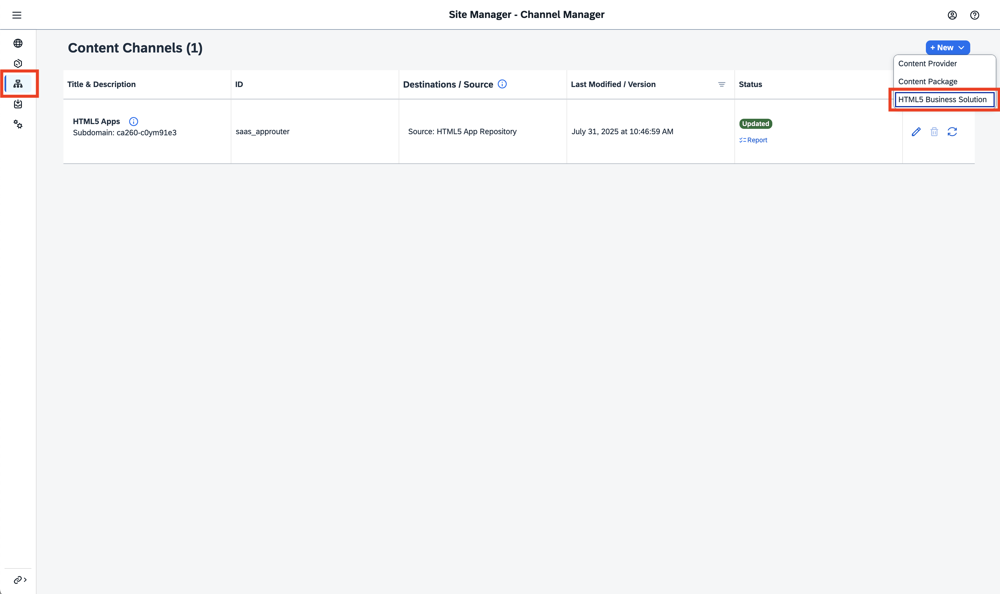

    
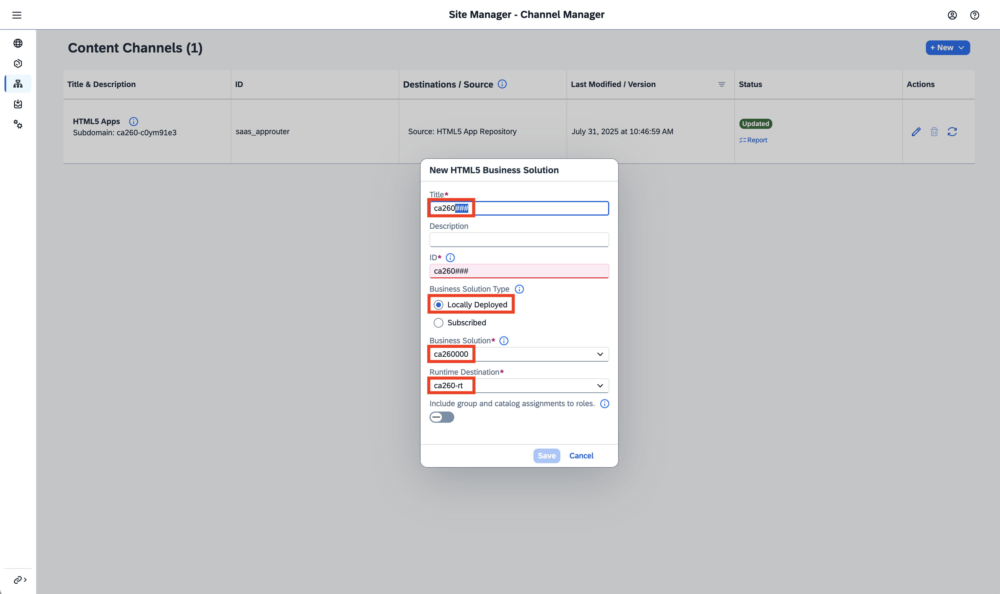

> [!NOTE]
> The *Runtime Destination* is used by *SAP Build Work Zone* to access the business solutions content.
> This includes launching our application's UI in an *iFrame* as well as fetching business data from APIs.
> For this workshop we have already configured it, as it is identical for all participants.
> Following these exercises in your own environment, you need to create the destination first according to the documentation and the deployment location of the HTML5 solution.

4. Click the button `Save`. The *Content Channel* will now be created.
    After a short moment it should have the status *Created*.
    When clicking on the *Report* link below, you should see that the following content was synchronized:

    - 1 Role
    - 1 App
    - 1 Catalog
    - 1 Space
    - 1 Page

> [!TIP]
> These content elements are coming from our deployment to the *HTML5 Repository*.
> The details of the *App* and its visual representation as a tile are derived from the web-application's UI5 manifest which can be found in the file `/app/incidents/webapp/manifest.json`.
> We will make some adjustments to this in the subsequent exercise.
> The remaining content artifacts are defined in the file `/workzone/cdm.json` following the *Common Data Model*. ([read more](https://help.sap.com/docs/build-work-zone-standard-edition/sap-build-work-zone-standard-edition/creating-cdm-json-file-for-multi-tenancy-html5-app?locale=en-US))

5. Head to the *Site Directory* using the burger menu on the left.
6. Click the `+ Create Site` button and enter `CA260-###` (replacing `###` with your participant number) as the *Site Name*. Complete the creation with the button `Create`.
7. The *Site Settings* should open now. Otherwise find *Site* with **your** participant number. Click on the small *gear* icon.
8. You should see the *Site Settings* for your *Site*, click `Edit`.
9. Modify the following settings:

    - Add `German (Germany)` to the available languages (optional)
    - Make sure *SAP Mobile Start* is **enabled** (default)
    - Enable *Joule*
    - Select the *View Mode*: `Spaces & Pages - New Experience`
    - Enable *Show Notifications*
    - Click the button `Save`

    
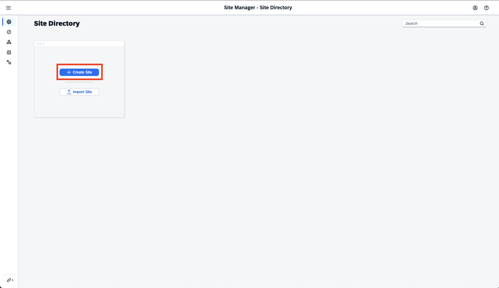

    
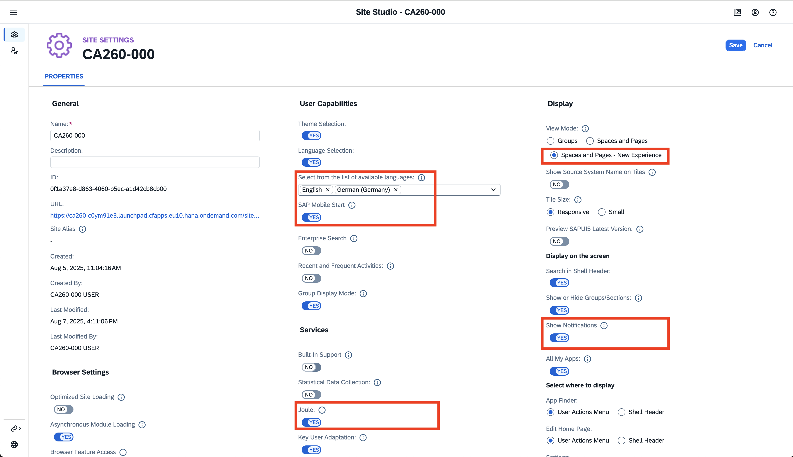

10. Head to the *Role Assignments* entry in the navigation menu on the left side. Click `Edit`.

11. Find the role with your participant number `CA260 ### Role` and enable the assignment of it to the *Site*.

    
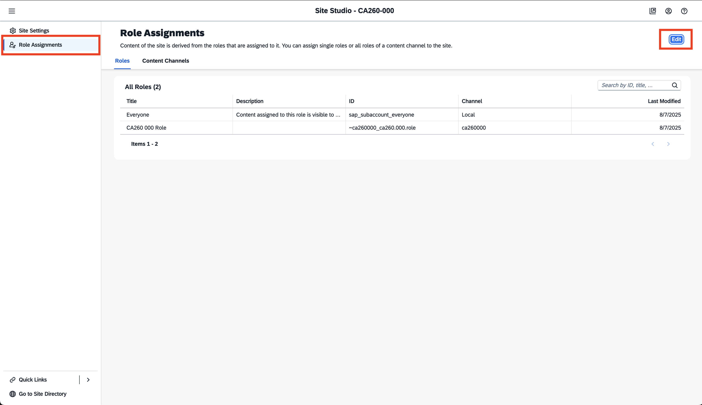

    
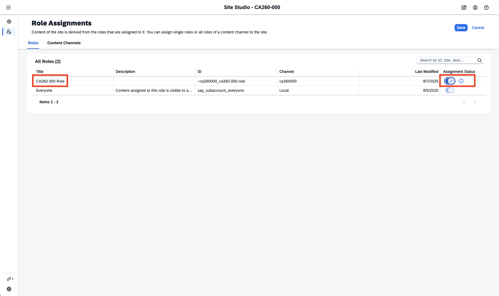

> [!TIP]
> As an alternative to assigning individual roles to your side, you can also assign all roles from a certain *Content Channel* to your *Site*.
> To do this, switch the tab above the table from `Roles` to `Content Channels`.
> As we have only exposed one role from our *HTML5 Business Solution*, you can choose either of both approaches without any drawback.

12.  Assign the Role `Internal Sales Representative` from the Channel `S4HANA` as well to your *Site*.
13.  Click `Save`.

> [!CAUTION]
> The role exposed from your *HTML5 Business Solution* needs to be assigned now to your user in the *SAP BTP Cockpit*.  
> Please **raise your hand and ask one of the instructors** to assign the role for your participant number.  
> This is important for the next exercises as you will only be able to see the content once this has been done.  
> Do not continue the exercises without an instructor having assigned you the needed role.

14. Click on the *User Icon* on the top right and choose `Sign out`. Confirm with `OK`.
15. Click `Sign in again` and log in with your provided credentials in order for the role assignment to take effect.

## Exercise 2.3 Check out your app in SAP Build Work Zone

With the previous steps completed, we can now take a look at the content from an end-user's perspective.

1. Find *Site* with **your** participant number.
2. Click on the small icon showing an *arrow in a box*, next to the *gear icon*, in order to open the *Site* as an end-user.
3. In the menu, find `Extensions from CA260`. You should be able to see an application tile named `Incidents Management`.
    
    
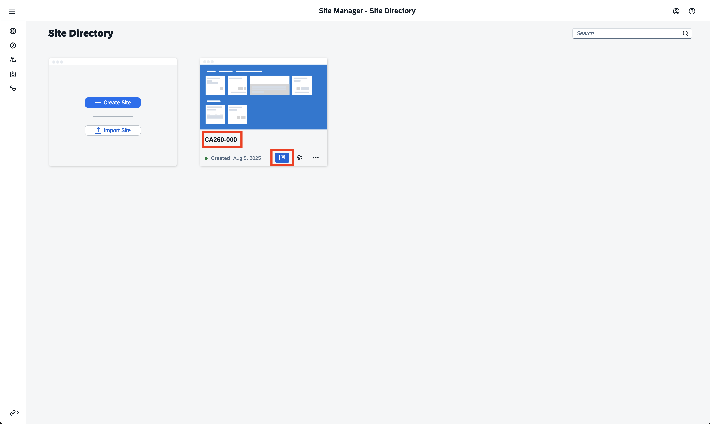

    

4. Click on the application tile. The *Incidents Management* application will now open and you should be able to see a list of incidents.

    
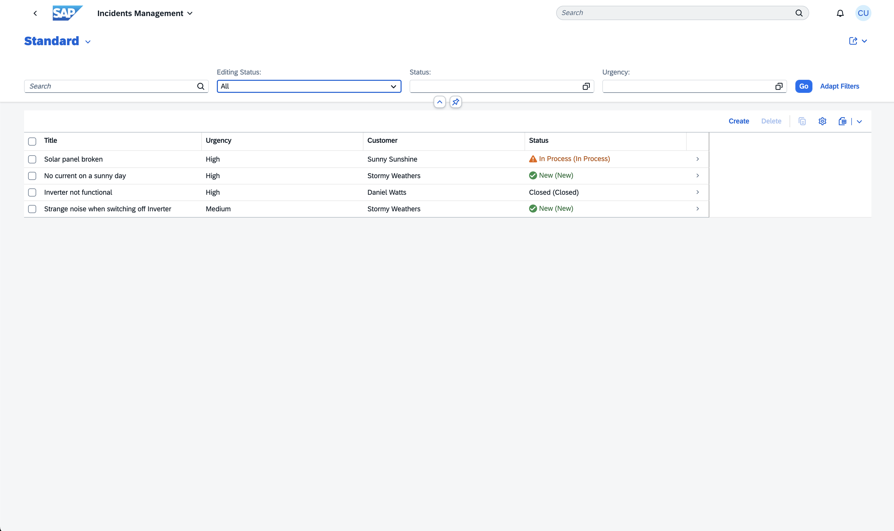

## Exercise 2.4 Onboard SAP Mobile Start

The exposed content can not only be accessed from a desktop browser but also using *SAP Mobile Start*.

1. On your *Site* in *SAP Build Work Zone*, click on your user-initials on the top right of the Shell Bar.
2. Click on `Settings` to open the user settings.
3. Select the setting entry `SAP Mobile Start Application`.
4. Toggle the switch to `Register`. Depending on the screen resolution, you might need to scroll down to make the full QR Code visible.
    
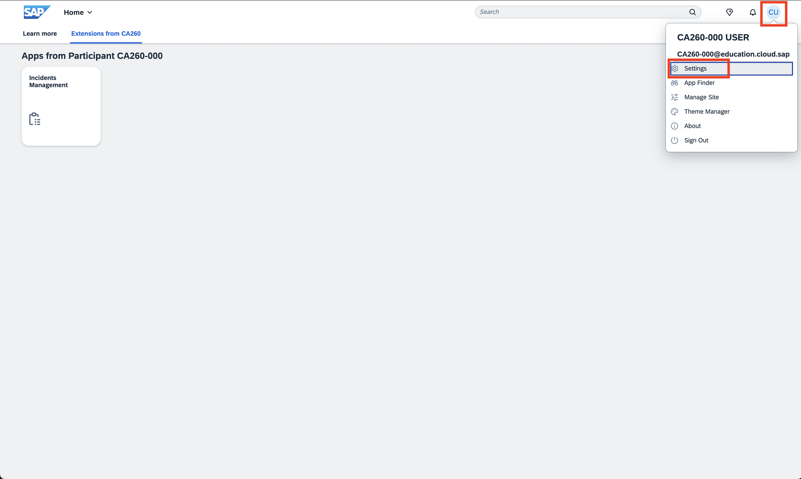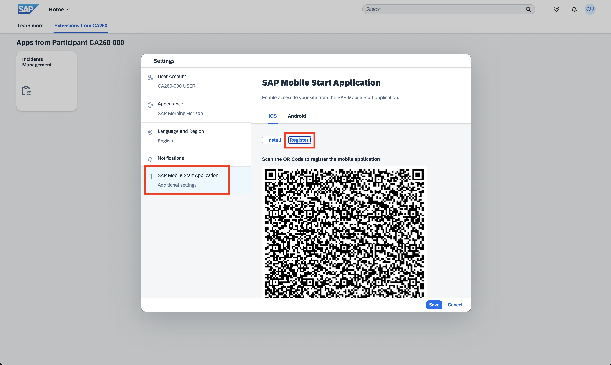

5. Open the *SAP Mobile Start* app on your smartphone.
6. Click on `Scan QR Code` and scan your *Site's* QR.
    
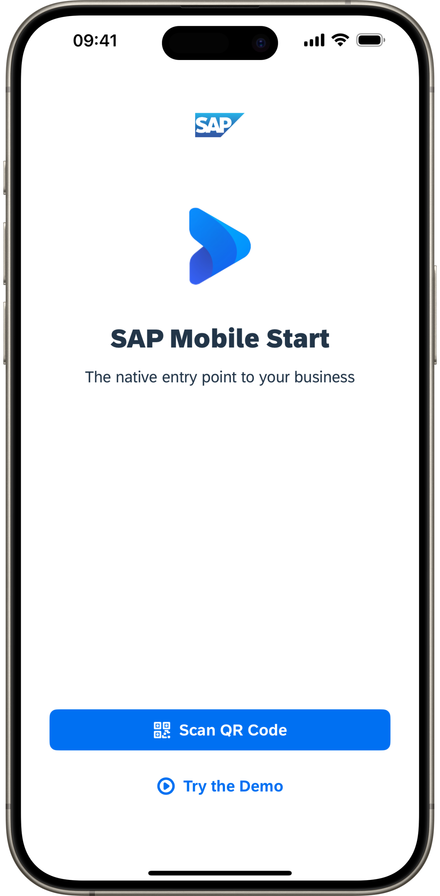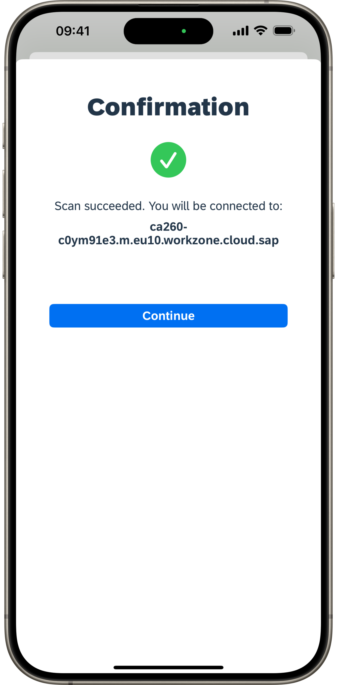

> [!CAUTION]
> If you freshly installed *SAP Mobile Start* to your device, your operating system will prompt you whether you want to allow to receive push notifications. Make sure to select **Yes** in order to allow receiving push notification. Exercise 4 will make use of that. If you declined the alert before or just now by accident, you can later allow push notifications for *SAP Mobile Start* in your device's settings.

7. Sign in with the provided credentials.
8. By switching to the *Apps* tab on the bottom, you should be able to see *Site's* content structure equivalently including the `Incidents Management` app.
   
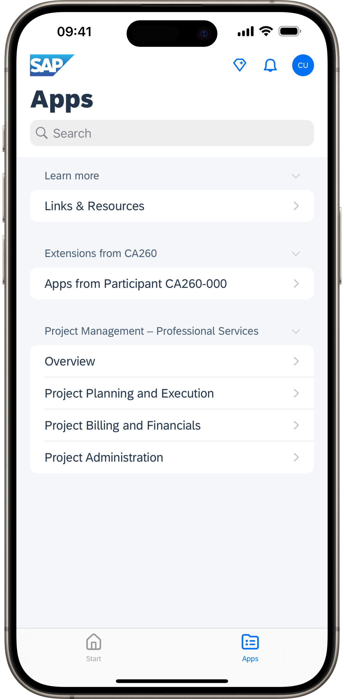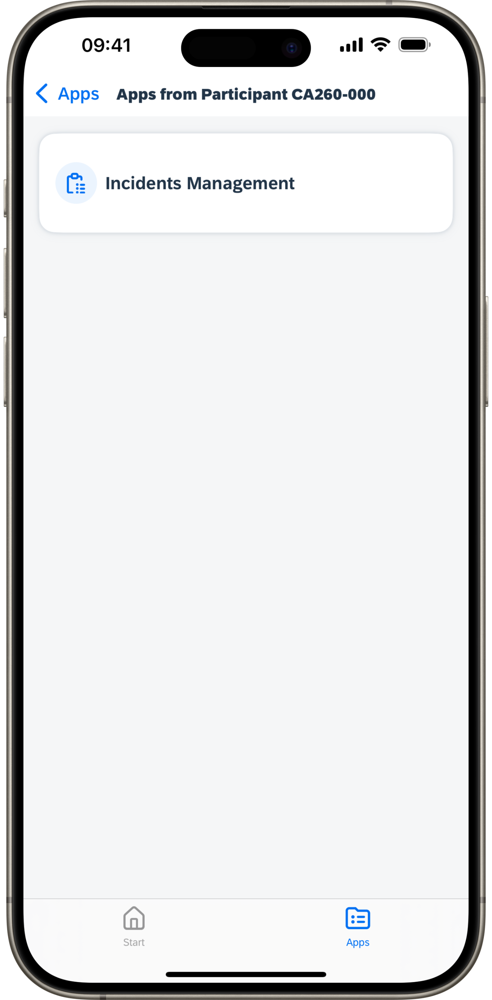

## Summary

You've now added your deployed app to *SAP Build Work Zone* by creating a new *Content Channel* of type *HTML5 Business Solution*. You have added the synchronized content to a newly created *Site*. With the correct roles assigned to your user, you can see and access the *Incidents Management* app from your browser. Additionally, you onboarded to the same environment with *SAP Mobile Start*, making the content seamlessly available on your mobile devices.

> [!IMPORTANT]
> **Kudos!** :trophy:
> You have completed the second exercise successfully.
> You seem to become a *Content Expert* in *SAP Build Work Zone*.
> Continue now with - [Exercise 3 - Extend the app to use Widgets on your mobile device](../ex3/).
