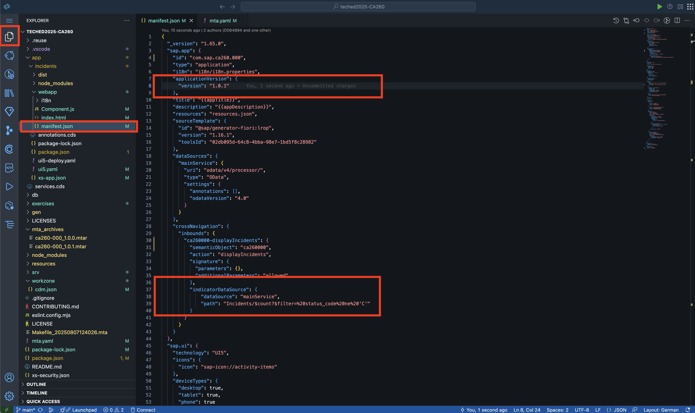
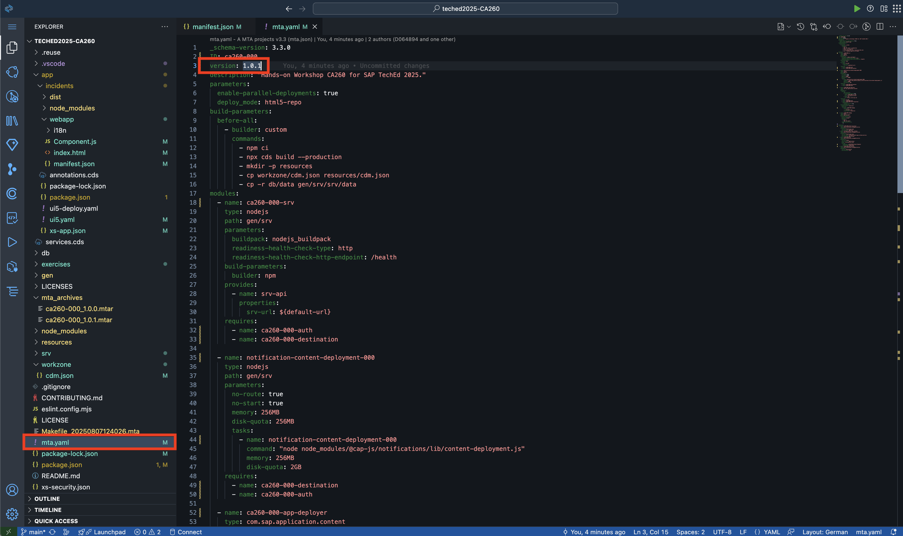
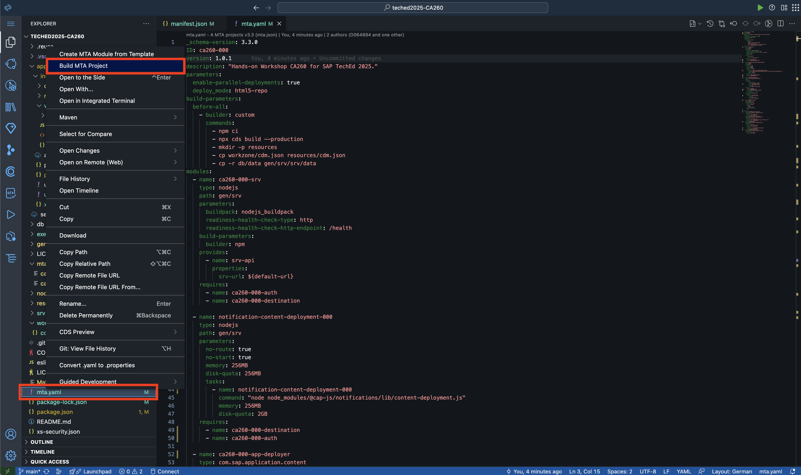
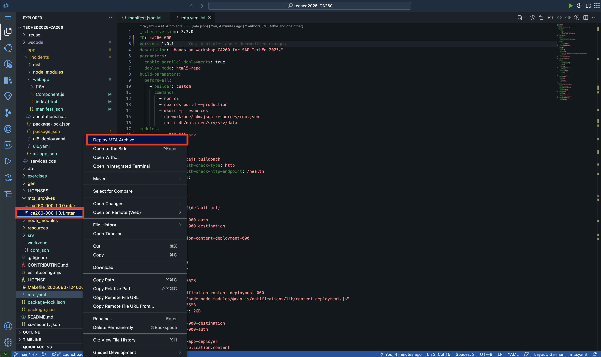
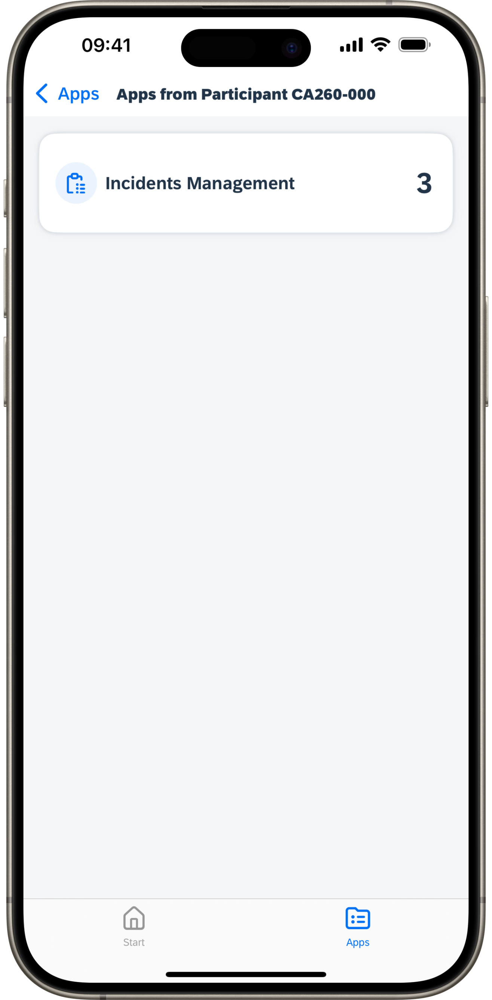
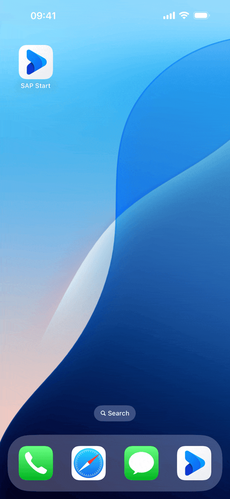

# Exercise 3 - Extend the app to use Widgets on your mobile device

SAP Mobile Start supports *Widgets* provided by the mobile operating system. With that users can monitor relevant business KPIs e.g. on their Lock- and Home Screen. In addition when using a compatible smartwatch, these KPIs can also be accessed from the Watch companion. The Apple ecosystem even supports placing these iOS Widgets onto a Mac that is paired to the iPhone via the same Apple ID.

<p align="center"></p>

In this exercise, we will extend our *Incidents Management* application to expose a tile displaying the KPI of open incidents. Such a dynamic tile, will not only show in *SAP Build Work Zone, standard edition* but in the same manner in *SAP Mobile Start*. As stated above, we will be able to add Widgets to our phone's Home Screen or Lockscreen pointing to this exposed *Monitoring Tile*.

## Exercise 3.1 Adjust the application's manifest

The details of the *App* in *SAP Build Work Zone* and its visual representation as a tile are derived from the web-application's UI5 manifest which can be found in the file `/app/incidents/webapp/manifest.json`. To alter its visual appearance, we will modify the manifest in the exercise.

1. Go back to your project of *SAP Build Code* opened in *SAP Business Application Studio*.

> [!TIP]
> If you accidentally closed the tab, you can navigate back to your project via the [SAP Build Lobby](https://ca260-c0ym91e3.eu10.build.cloud.sap/lobby).

2. Open the file `/app/incidents/webapp/manifest.json` from the Project Explorer view.
3. Increase the version number value from `1.0.0` to `1.0.1` under the JSON property `sap.app/applicationVersion/version`.

> [!NOTE]
> Increasing the version number is required, whenever you are doing a modification to the HTML5 app and its resources in order for the *HTML5 Repository* to identify a deployment as push of a updated version.

4. Find the node in the file `sap.app/crossNavigation/inbounds/ca260###-displayIncidents`. Add a `,` **after** the closing-bracket `}` of the `signature` child node inside the inbound. Afterwards, add the following snippet below:

    ```json
    "indicatorDataSource": {
        "dataSource": "mainService",
        "path": "Incidents/$count?$filter=%20status_code%20ne%20'C'"
    }
    ```

    Afterwards, the `crossNavigation` node shall look like this (`###` replaced with your participant number):

    ```json
    "crossNavigation": {
      "inbounds": {
        "ca260###-displayIncidents": {
          "semanticObject": "ca260###",
          "action": "displayIncidents",
          "signature": {
            "parameters": {},
            "additionalParameters": "allowed"
          },
          "indicatorDataSource": {
              "dataSource": "mainService",
              "path": "Incidents/$count?$filter=%20status_code%20ne%20'C'"
          }
        }
      }
    }
    ```

    <p align="center"></p>

> [!NOTE]
> The property `indicatorDataSource` is responsible for configuring the KPI to be shown on the application tile as well as in mobile widgets.
> We reference to the CAP API for the *ProcessorService* as `mainService` that is defined further above.
> As `path`, we point to the `Incidents` entity and apply the OData `$count` action.
> Furthermore, we apply a `$filter`, to only count the incidents with a `status_code` that is **not equal** to `'C'`, which refers to *closed*.

## Exercise 3.2 Build and deploy the updated application

We will now prepare the project for building & deploying the updated application.

1. Open the file `mta.yaml`.
2. Update the `version` number in line 3 as well to the same version number, that we defined in the manifest (`1.0.1`).
3. Right-click onto the file `mta.yaml` and select `Build MTA Project` from the context menu.

    <p align="center"></p>

4. After the build process has finished, find the resulting artifact under `/mta_archives`.
5. Right click on the new `ca260-###_1.0.1.mtar` file and select `Deploy MTA Archive` from the context menu.

    <p align="center"></p>

6. Wait for the deployment process to complete.
7. Afterwards, head again to the *Site Manager* of [*SAP Build Work Zone, standard edition*](https://ca260-c0ym91e3.dt.eu10.workzone.cloud.sap).
8. Select the *Channel Manager* from the menu on the left side.
9. Find your *Content Channel* with your participant number.
10. Click on the *Update* icon.
11. The status should change now to *Updating*, after a short moment it should again change to *Updated*.

    <p align="center"></p>

## Exercise 3.3 Check the result in SAP Mobile Start

1. Open up *SAP Mobile Start* again.
2. Select the *Apps* from the tab bar.
3. Navigate into your participants page under the `Extensions from CA260` space.
4. If the page was already loaded from Exercise 2, perform a *Pull to Refresh* by dragging the content on the screen down. A loading indicator should.
5. After a short moment, the number of open incidents should show on the application tile of our *Incidents Management* app.
   <p align="center"></p>

> [!NOTE]
> The subsequent steps show the creation & configuration of Widgets on iOS.
> The process on Android is similar, for more information you can consult the [Android Help (external link)](https://support.google.com/android/answer/9450271?hl=en#).
> If needed, you can also consult the [User Guide for Widgets](https://help.sap.com/docs/mobile-start/user-guide/widgets?locale=en-US) of SAP Mobile Start on SAP Help.

6. Go to your iOS Home Screen, by moving *SAP Mobile Start* to the background.
7. Long-press on an empty area of your Home Screen until the *Edit* mode activates and your apps begin to shake.
8. Tap on `Edit` in the top left and select `Add Widget`.
9. Search for `SAP` until you see `SAP Start` in the list. Tap on it.
10. Select one of the `Business Info Widget` types and tap the button `Add Widget`.
11. Long-press on the newly created *Business Info Widget* of *SAP Mobile Start* until the context menu shows. Select `Edit Widget`.
12. Under *Business App* tap the button `Select`.
13. Find your *Incidents Management* app and tap on its list entry.
14. The Widget should now load the data for *Incidents Management* and display the current count of open incidents.

<p align="center"></p>

> [!TIP]
> Feel free to also try out the other ways of using Widgets:
>
> - On the Lock Screen of your iPhone or iPad (iPad: only iOS 17 or later)
> - On the StandBy screen of your iPhone (only iOS 17 or later)
> - In the Smart Stack of your Apple Watch (only watchOS 10 or later)
> - As Complications on the watch face of your Apple Watch or Android smartwatch

<p align="center"></p>

> [!IMPORTANT]
> **Very nice!** :tada:
> You have completed Exercise 3 successfully.
> Keep up the good work, you are mastering the exercises!
> Continue now with - [Exercise 4 - Implement your own (push) notifications](../ex4/).
