# Exercise 4 - Implement your own (push) notifications

In the previous exercise, we extended our application to make use of mobile native features – namely Widgets.
With Exercise 4 we want to take it one step further.
We will be extending our *CAP* application to issue notifications upon certain events.
These notification will not only show under the notification bell in *SAP Build Work Zone*, additionally these will be automatically delivered to *SAP Mobile Start* – both displayed inside the app as well as in the form of **push notifications**.
Using this approach, we can inform our users proactively about important events and business critical situations.

## Exercise 4.1 Preparations to use notifications with CAP

In order for being able to use notifications with *CAP*, certain preparational steps need to be executed.
We have already completed these steps for this hands-on workshop, but still want to show them to gain a better understanding. *CAP* is capable of sending notifications to the *SAP Alert Notification Service*, which is [included in the subscription](https://help.sap.com/docs/build-work-zone-standard-edition/sap-build-work-zone-standard-edition/enabling-notifications?locale=en-US) of *SAP Build Work Zone, standard edition*. Sending notifications from our application to this instance results in them to appear not only on our *SAP Build Work Zone Site* when using the desktop browser, but as well in SAP Mobile Start including mobile push notifications.

1. Go back to your project of *SAP Build Code* opened in *SAP Business Application Studio*.

> [!TIP]
> If you accidentally closed the tab, you can navigate back to your project via the [SAP Build Lobby](https://ca260-c0ym91e3.eu10.build.cloud.sap/lobby).

2. Open the `package.json` file from the *Explorer* view and find the entry `@cap-js/notifications` under `dependencies`.

    <p align="center">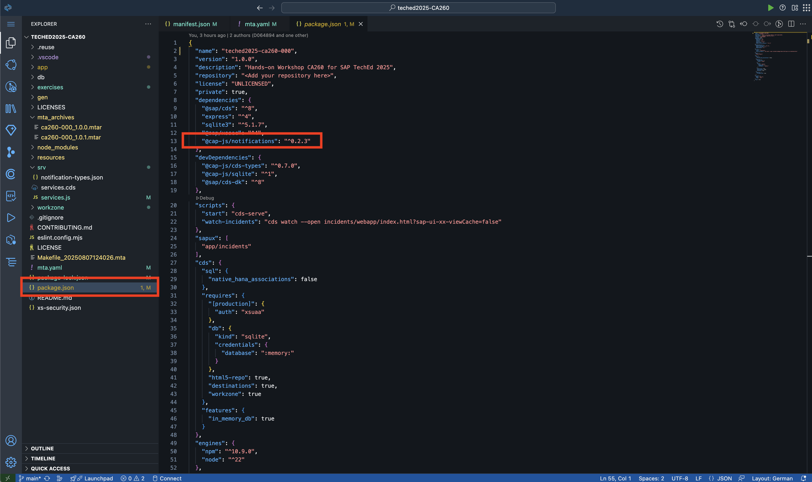</p>

> [!NOTE]
> The `package.json` file manages the dependencies for the *CAP* Node.JS project and includes additionally some *CAP* specific configurations.
> *CAP* is capable of sending notifications to *SAP Build Work Zone* using a dedicated *CAP Plugin* `@cap-js/notifications`, which sources are open-source and can be found on [GitHub](https://github.com/cap-js/notifications). Read more about [Notifications in the CAP Documentation](https://cap.cloud.sap/docs/plugins/#notifications).

3. The plugin communicates with the necessary APIs using a *Destination* that needs to be created in the *SAP BTP Subaccount* in which the application will run. By default it expects the name for the *Destination* to be `SAP_Notifications` if not configured differently.

    <p align="center">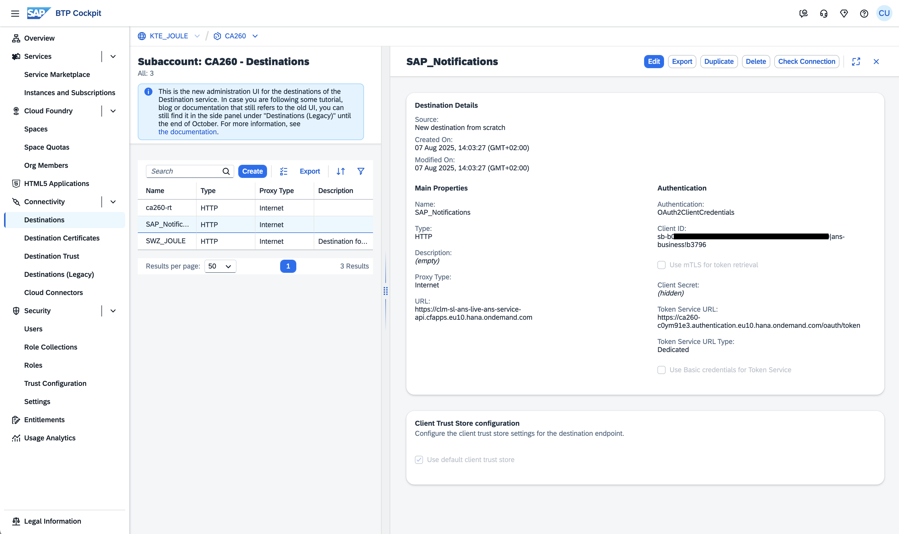</p>

> [!NOTE]
> We have created this destination already for you centrally in our *SAP BTP Subaccount* for this hands-on session. No action required for you other than understanding the concept behind it.
> The connection details for the destination can be retrieved from the *Administration Settings* under the tab *Notification* in *SAP Build Work Zone, standard edition* with appropriate authorizations. Read more about this in the [public documenation on SAP Help](https://help.sap.com/docs/build-work-zone-standard-edition/sap-build-work-zone-standard-edition/enabling-notifications-from-cloud-solutions#overview).

4. Open now the file `/srv/notification-types.json` in your *SAP Business Application Studio* project.
    This file defines the notification types for our application which we will use in a short moment.

    <p align="center">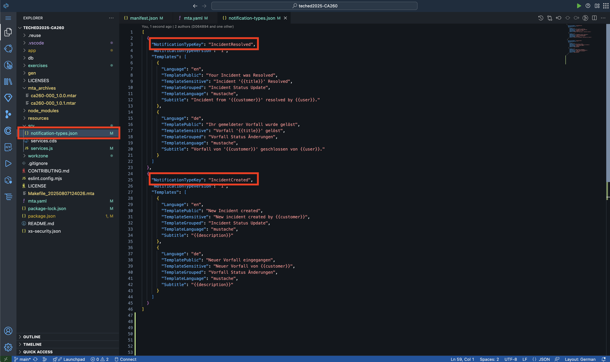</p>

> [!NOTE]
> *Notification Types* can be seen as templates with certain placeholders for the actual notification.
> With that, we can easily reference those templates in our application logic and only fill the placeholders and other required data – like intended recipients.
> For our example, we have created two types `IncidentCreated` and `IncidentResolved`.
> We will reference these later with their `NotificationTypeKey`.
> Additionally, take a look at the translated template texts with certain placeholders for data.
> 
> The defined *Notification Types* of our application will be created or updated in the actual system during deployment of our *Multi Target App*.
> Looking back at the end of *Exercise 1*, the second application visible on the *SAP BTP*, in our *Space* under *Applications* called `notification-content-deployment-###` is exactly for this purpose.
> During deployment it is being started with the `notification-types.json` file contents and creating / updating the *Notification Types*. Afterwards it is being stopped to save resources.

  <p align="center">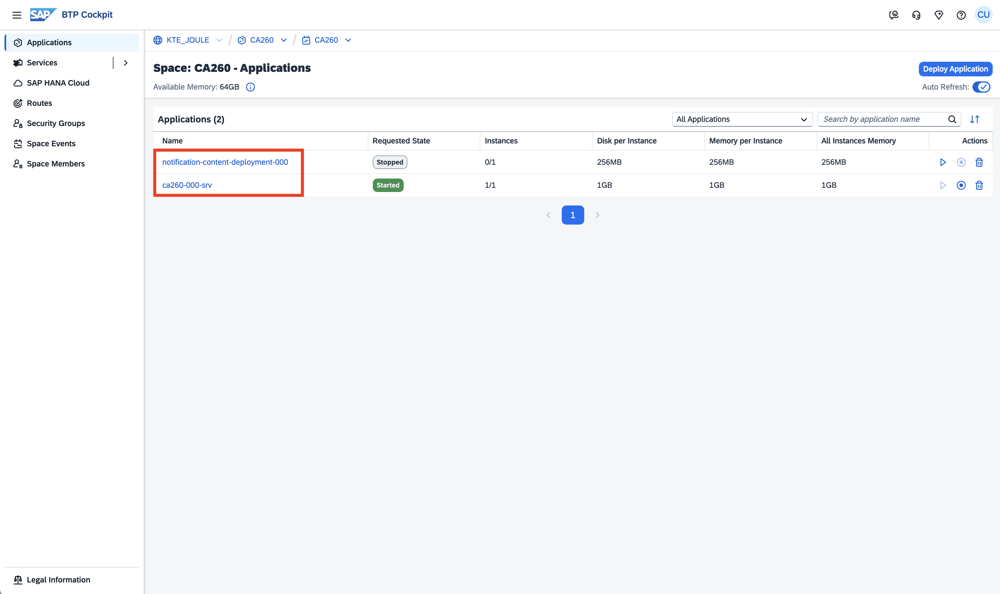</p>

## Exercise 4.2 Extending our application to send notifications

With the preparations being completed, we can now continue with actually sending notification from our application code.

1. Go back to your project of *SAP Build Code* opened in *SAP Business Application Studio*.

> [!TIP]
> If you accidentally closed the tab, you can navigate back to your project via the [SAP Build Lobby](https://ca260-c0ym91e3.eu10.build.cloud.sap/lobby).

2. Open the file `/srv/services.js`, in which we can extend and customize our *CAP* services with own application logic.

3. Uncomment the coding snippet **after** the comment saying `STEP 4.2.3`. Afterwards, the `async init()` function should include the lines:

    ```js
    const alert = await cds.connect.to('notifications')
    const { Incidents } = this.entities
    ```

> [!NOTE]
> `cds.connect.to()` is the general method within CAP, to establish the connection to a declared service of the project.
> With the value `notifications` we connect to the *Notification Service* using the package added to the dependencies.
> As return value we receive a handle with which we can send notifications later.

4. Uncomment now the next coding snippet **after** the comment saying `STEP 4.2.4`. Now our `init` function includes the following snippet, after the `notifications` service has been initialized:

    ```js
    this.after('CREATE', Incidents, async incident => {
      let [ customer, supporters ] = await Promise.all ([
        getCustomerDataFor(incident),
        getResponsibleSupportersFor(incident)
      ])
      await alert.notify ('IncidentCreated', {
        recipients: supporters, // for demo purposes, we will deliver the notificaiton to ourself
        priority: { H: 'HIGH', L: 'LOW' }[incident.urgency_code],
        data: {
          customer: customer.info,
          description: incident.title,
        },
        ...getNavigationPropertiesFor(incident)
      })
    })
    ```

> [!NOTE]
> We leverage lifecycle events on our desired entity `Incidents`, namely **after** the **creation** of a new instance of such.
> Hooking into this event gives us the opportunity to run custom logic, whenever a new *Incident* is being created.  
>
> Using `alert.notify` we can issue a new notification.
> In this example we do reference the *Notification Type* `IncidentCreated` that we have noted from the `notification-types.json` file.
> For demo purposes, we add our own user as a recipient.
> This is done in the utility method `getResponsibleSupportersFor(incident)`, simulating we are notifying the supports on duty.
> The priority of the notification is picked based on the incidents urgency.  
>
> With that, we can fill the placeholders defined in the *Notification Type's* template.
> Lastly, we add information how to navigate into the right *Incident* object of our web-app using *Intent Based Navigation*.
> This is derived using the utility method `getNavigationPropertiesFor(incident)`, defined further down.

> [!TIP]
> Navigation works correctly because our application has defined a unique *Semantic Object* and *Action* which we do reference here (`ca260###-displayIncidents` – again `###` replaced with your participant number).
> With that SAP Build Work Zone and SAP Mobile Start can identify the correct web application to launch.
> By utilizing a special navigation parameter `sap-ushell-innerAppRoute`, we can instruct our *in-place* launched *SAP Fiori Elements* application to open a dedicated inner route defined in our web-app.
> As a value the utility passes `Incidents(ID=${incident.ID},IsActiveEntity=true)`, filling in the actual ID of the relevant incident.
> We'll see later, that our web-app can successfully open the detail page of the relevant incident with this approach.

5. Now, please uncomment the last snippet **after** the comment saying `STEP 4.2.5`. After this, our `init` function is enhanced with another block of application block adding yet another lifecyle event with custom logic:

    ```js
    this.after('UPDATE', Incidents, async incident => {
      if (incident.status_code === 'C') {
        let [ customer, recipients ] = await Promise.all ([
          getCustomerDataFor(incident),
          getResponsibleSupportersFor(incident)
        ])
        await alert.notify ('IncidentResolved', {
          recipients: recipients, // for demo purposes, we will deliver the notificaiton to ourself
          data: {
            customer: customer.info,
            title: incident.title,
            user: cds.context.user.id,
          },
          ...getNavigationPropertiesFor(incident)
        })
      }
    })
    ```

> [!NOTE]
> This second lifecycle event attaches to the moment **after** `Incidents` have been **updated**.
> The custom logic only continues, if the new `status_code` is `C`, which refers to `Closed`.
> In such cases yet another notification is being sent, again to us as recipients for demo purposes.
> This time, we use the other *Notification Type* `IncidentResolved` and its template.

6. Having completed these modifications, your file's content should look like in the following screenshot. Make sure to save the file.
    <p align="center">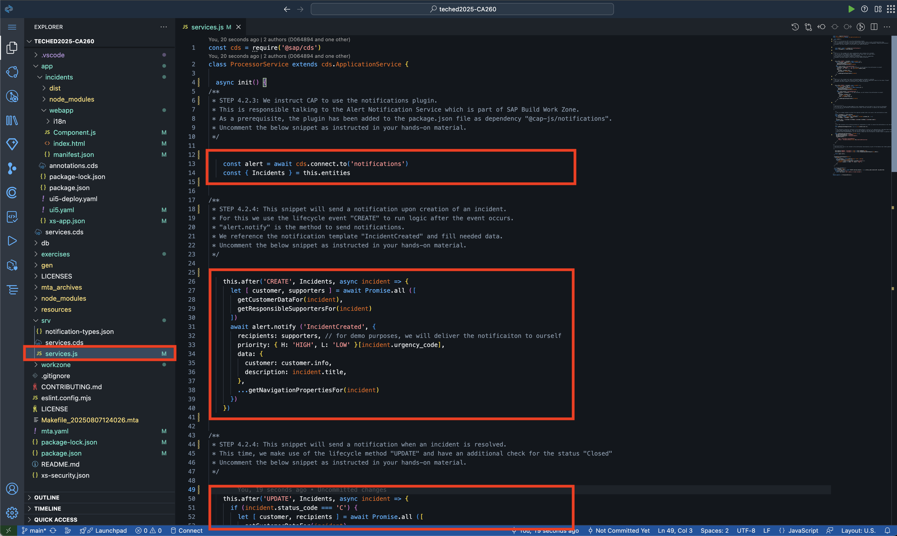</p>

## Exercise 4.3 Build and deploy the updated application

We will now prepare the project for building & deploying the updated application.

1. Open the file `mta.yaml`.
2. Increase the `version` number in line 3 (e.g. to `1.0.2`).
3. Right-click onto the file `mta.yaml` and select `Build MTA Project` from the context menu.

    <p align="center">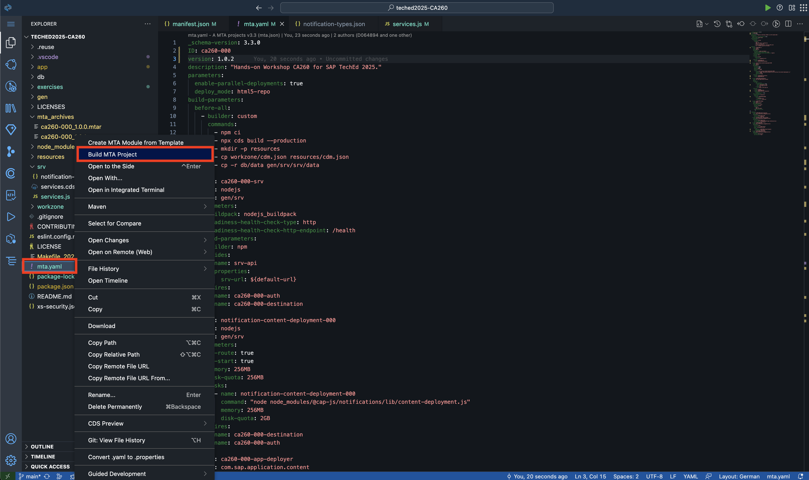</p>

4. After the build process has finished, find the resulting artifact under `/mta_archives`.
5. Right click on the new `ca260-###_1.0.2.mtar` file and select `Deploy MTA Archive` from the context menu.

    <p align="center">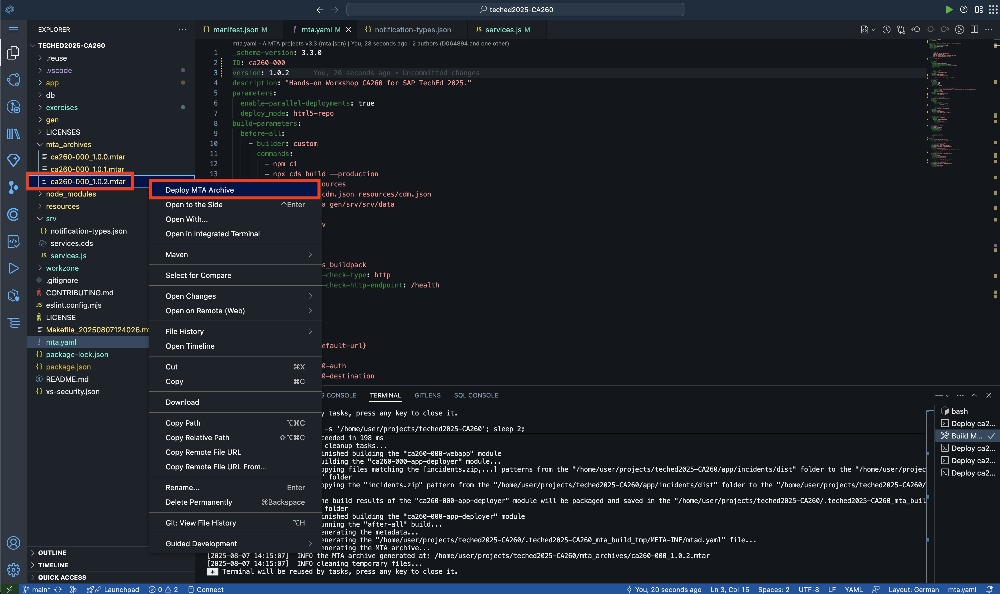</p>

6. Wait for the deployment process to complete.

> [!NOTE]
> This time, we do **not** need to re-sync our *Content Channel* in *SAP Build Work Zone* since we did not do change that would need to be synchronized to *SAP Build Work Zone* to take effect.
> Our extension to the *CAP* application code is immediately effective as the application code is being deployed to *SAP BTP Cloud Foundry*.

## Exercise 4.4 Check the result in SAP Mobile Start

1. On your *Site* in *SAP Build Work Zone* click on the application tile of your *Incidents Management* app like in Exercise 2.3.
    <p align="center">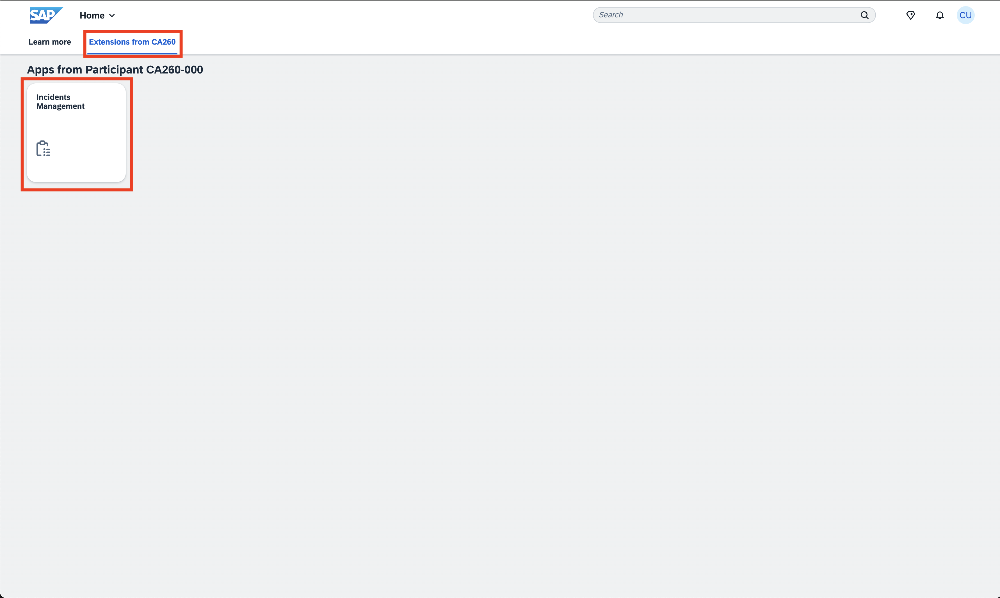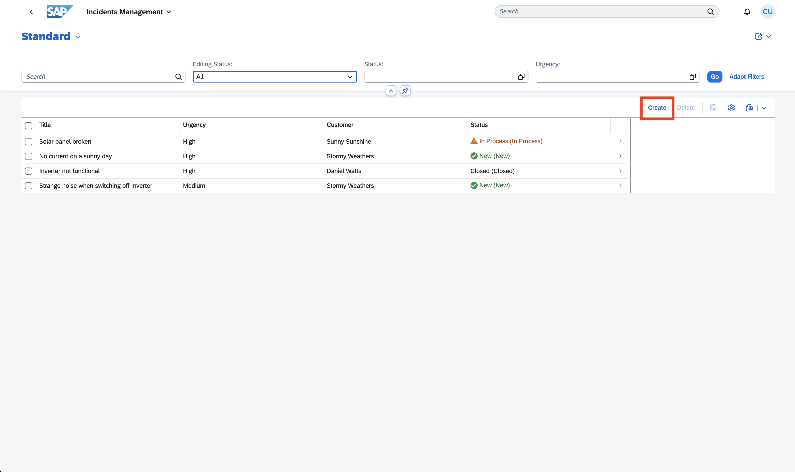</p>
2. In the table of *Incidents*, click on the `Create` button.
3. Fill the *Incidents* data to your liking and save your *Incident* using the `Save` button. 
    <p align="center">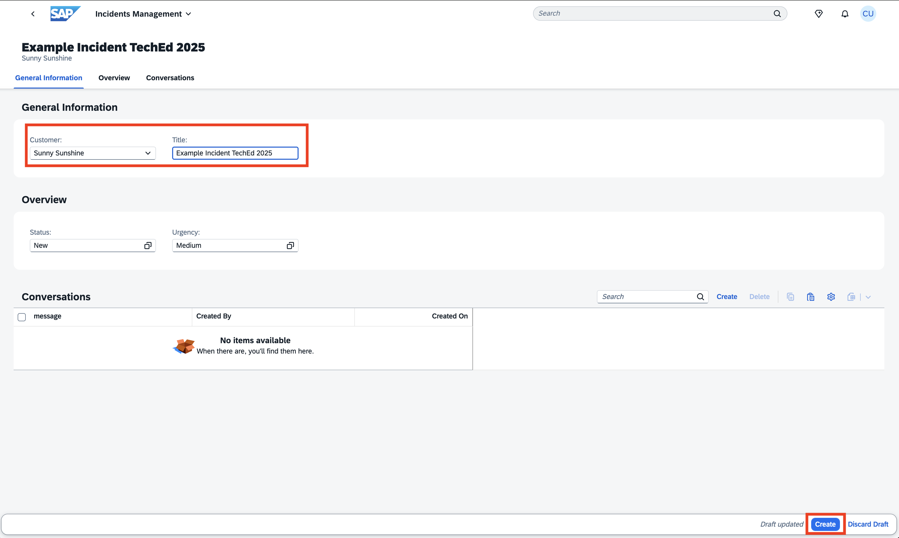</p>
4. After a short moment, a push notification should be delivered to your mobile device running *SAP Mobile Start*.
    <p align="center">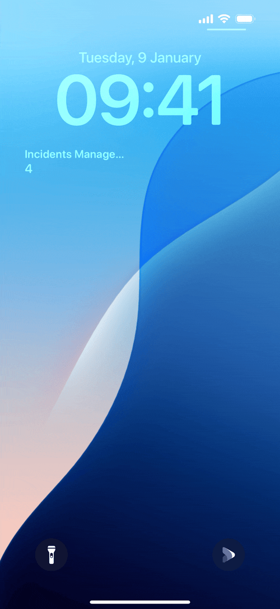</p>
5. By tapping on the push notification, you will be directed into the detail view of this push notification.

> [!NOTE]
> In case you disabled push notifications generally or only for *SAP Mobile Start*, you can alternatively tap on the bell-icon at the top right within *SAP Mobile Start* and find all your notifications in the list.

6. The detail view will display the full details for the notification that we have crafted in our *CAP* application.
7. By tapping on *Open in Browser*, our *CAP* application will open in the in-app browser directly navigating to this incident's object view.
    <p align="center">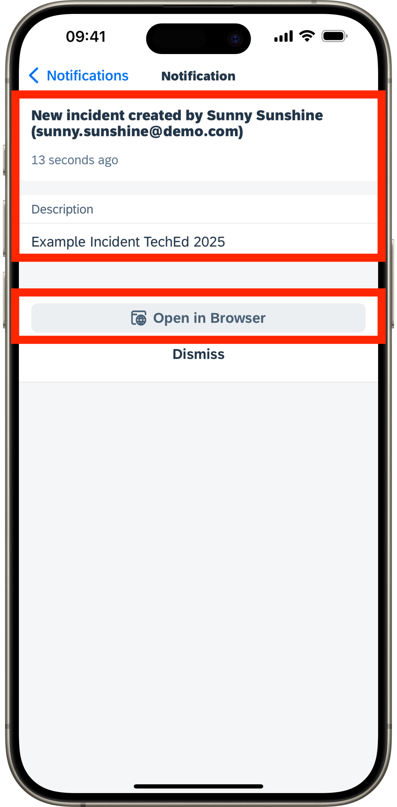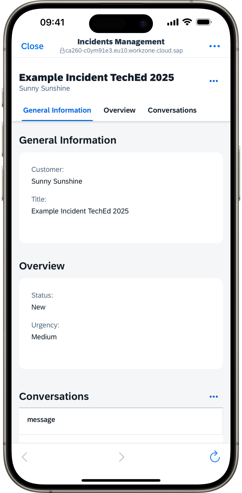

> [!NOTE]
> You can also try out the second notification that we have added to our application, by editing your incident and set it to status `C – Closed`.

> [!IMPORTANT]
> **Wow!** :clap:
> You have officially completed the final exercise of CA260 as part of SAP TechEd 2025.
> We hope that we were able to demonstrate how easy it is to create pro-code extensions for *SAP Mobile Start* leveraging the native capabilities of mobile devices.  
> Go back to the [Overview](../../) of this repository.
